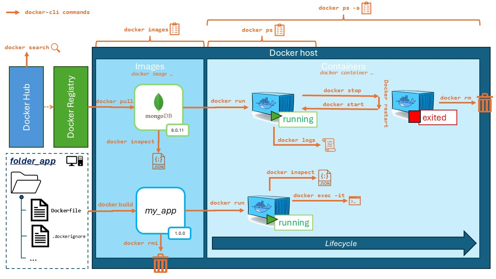
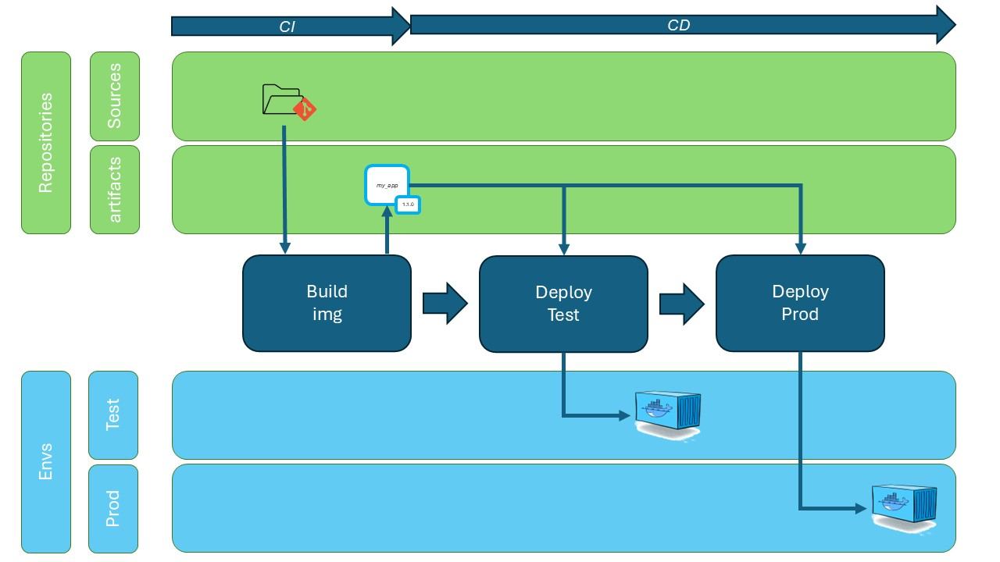

# 1ere manipulation avec Docker


## Architecture de Docker

L’architecture de Docker repose sur un modèle **client–serveur**. Elle se compose principalement de trois éléments :

- **Le client Docker (`docker`)** : outil en ligne de commande permettant d’interagir avec Docker. Il envoie des requêtes au démon via l’API REST.
  
- **Le démon Docker (`dockerd`)** : service principal qui exécute les instructions. Il gère les conteneurs, images, volumes, réseaux, etc.

- **L’API REST de Docker** : interface utilisée par le client pour communiquer avec le démon. Toutes les commandes passent par cette API.

### Composants clés :

- **Images Docker** : modèles figés contenant une application et son environnement.
- **Conteneurs Docker** : instances exécutables créées à partir des images.
- **Registres Docker** : dépôts (comme Docker Hub) où les images sont stockées et partagées.

### Fonctionnement bas niveau :

Docker utilise des fonctionnalités du noyau Linux (ou de WSL2 sur Windows) :

- **Namespaces** : pour isoler les processus, réseaux, utilisateurs, etc.
- **cgroups** : pour limiter l’utilisation des ressources (CPU, RAM, etc.)

Grâce à cela, plusieurs conteneurs peuvent s’exécuter isolément sur une même machine, tout en partageant le même noyau système, ce qui rend Docker plus léger qu’une machine virtuelle.

## Comprendre les images et les conteneurs Docker

### Images Docker

- Une **image Docker** est un **modèle immuable** qui contient tout ce dont une application a besoin pour fonctionner : le système de fichiers, les bibliothèques, le code, les dépendances, les configurations, etc.
- C’est un peu comme un **snapshot** ou un **template**.
- Les images sont construites à partir d’un **Dockerfile**, qui décrit étape par étape comment créer l’image.
- Elles sont stockées dans des registres, comme **Docker Hub**, pour être partagées et téléchargées.
- Une image ne s’exécute pas : elle sert de base pour créer des conteneurs.

### Conteneurs Docker

- Un **conteneur Docker** est une **instance en cours d’exécution** d’une image Docker.
- C’est un environnement isolé qui fonctionne comme un processus léger, avec ses propres systèmes de fichiers, réseau et processus.
- On peut démarrer, arrêter, redémarrer, et supprimer un conteneur.
- Les conteneurs sont **éphémères** : par défaut, les modifications à l’intérieur d’un conteneur sont perdues à sa suppression, sauf si on utilise des volumes pour la persistance.
- Plusieurs conteneurs peuvent être lancés à partir de la même image, chacun isolé et indépendant.

### Analogie simple

- **Image** = plan architectural ou recette de cuisine  
- **Conteneur** = bâtiment construit ou plat cuisiné à partir de la recette

## Spreadsheet



## Deploiement CI/CD avec Docker



## On commence la pratique

Pour commencer, vérifions que l'on sait bien faire un "hello-world"

```bash
docker run hello-world
```

